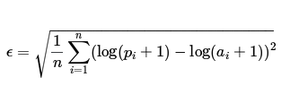

# Taxi trip duration prediction

## Main goal
Creating taxi trip duration predictor model. 

## Data description

Primary dataset is one released by the NYC Taxi and Limousine Commission, which includes pickup time, geo-coordinates, number of passengers, and several other variables. The training set contains 1458644 trip records.

*** Data fields ***

* id - a unique identifier for each trip
* vendor_id - a code indicating the provider associated with the trip record
* pickup_datetime - date and time when the meter was engaged
* dropoff_datetime - date and time when the meter was disengaged
* passenger_count - the number of passengers in the vehicle (driver entered value)
* pickup_longitude - the longitude where the meter was engaged
* pickup_latitude - the latitude where the meter was engaged
* dropoff_longitude - the longitude where the meter was disengaged
* dropoff_latitude - the latitude where the meter was disengaged
* store_and_fwd_flag - This flag indicates whether the trip record was held in vehicle memory before sending to the vendor because the vehicle did not have a connection to the server - Y=store and forward; N=not a store and forward trip
* trip_duration - duration of the trip in seconds

## Metric

The evaluation metric for this competition is Root Mean Squared Logarithmic Error.

## Tasks realized 

1) Primary data analysis; data cleaning;
2) New feature generation
3) EDA;
4) Feature transformation;
5) Feature selection
6) Model selection (LinearRegression, DecisionTree, Ensembles) according to the best metric value obtained. Hyperparameters optimization

## Summary

Following models were fit and assessed according to the metric specified: LinearRegression, DecisionTreeRegressor, RandomForestRegressor, GradientBoostingRegressor, XGBoost. The best metric was obtained with GradientBoostingRegressor: 0.37 (train set), 0.39 (valid.set). The most important features used by algorithm were: total_distance, total_travel_time, pickup_hour. 

## Libraries & tools used
* see the requirements 
